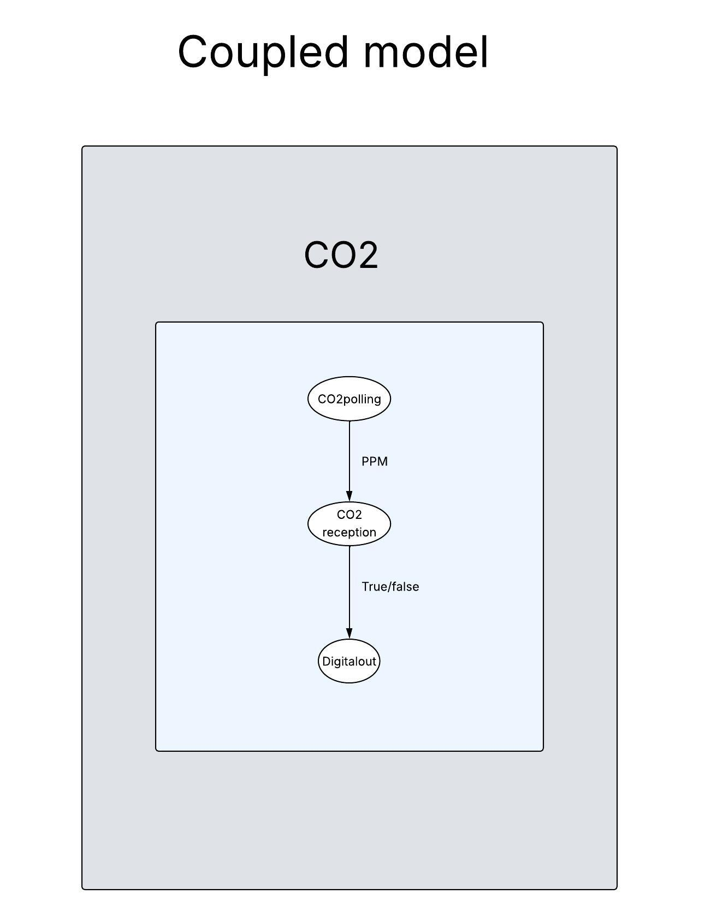

# stm32_CO2
This project is a DEVS-based example running on an STM32H743ZI2 development board. It models a system that turn a LED on and off depending on the amount of CO2 in the environment.

## Features

- Real-time CO₂ and temperature monitoring
- Implemented using the DEVS formalism with Cadmium
- Runs on STM32H743ZI2 using ARM toolchain

## Prerequisites

- STM32H743ZI2 development board connected via USB
- CO₂ sensor properly wired (see installation diagram below)
- Cadmium simulato installed
- ARM toolchain: `gcc-arm-none-eabi`

## Installation

1. **Install the ARM GCC toolchain**:

```bash
sudo apt install gcc-arm-none-eabi
```
## Wiring and running 
1. **Wirning**:

### MG-811 – CO₂ Sensor (Analog Output)

| Signal | MG-811 Pin | STM32 Pin Example | Notes                                 |
|--------|------------|-------------------|---------------------------------------|
| VCC    | V+         | 5V                | Requires stable 5V supply             |
| GND    | GND        | GND               | Common ground                         |
| OUT    | AO         | PA0               | Analog output connected to ADC input  |


2. **Running**:

```bash
git clone https://github.com/Ouabm/stm32_CO2.git
```
  then
```bash
cd stm32_CO2/
```
  then
```bash
./build_stm32
```

